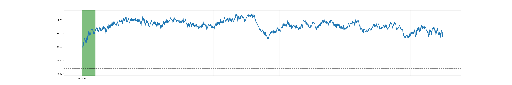
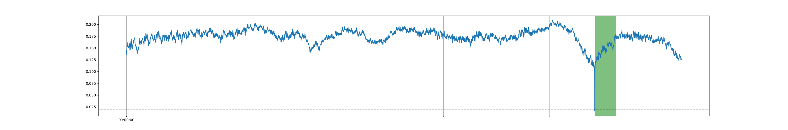

# AudioADRemover

## What is AudioADRemover
  AudioADRemover is a simple tool to find and remove an audio snippet(such as Audio Advertisement) in multiple audio files. 

## Getting started

Usage:
```
pip install -r requirements.txt

usage: findAndRemoveAds.py [-h] ad_file input_dir output_dir

Example:
python findAndRemoveAds.py --ad_file /tmp/ad/sj_ad1.mp3 --input_dir /tmp/input_audio_dir/ --output_dir /tmp/ad/output/
```

## Sample result




## Attention
ad_file is the target audio snippet which will be removed, please generate it yourself.
